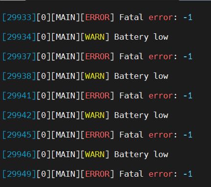

# Embedded Logging Framework - STM32 Example

Example project demonstrating a portable embedded logging framework using:

- Debug Module (Logging Framework)
- OSAL (Operating System Abstraction Layer)
- STM32 HAL (USB CDC / UART)

---

## ✨ Overview

This project shows how to integrate a reusable and portable logging framework
in an STM32-based embedded system.

It demonstrates:
- OS abstraction (OSAL)
- Transport abstraction (USB CDC / UART)
- Thread-safe logging
- Configurable log formatting

---

## 📂 Project Structure
Embedded-Logging-Framework-Example-STM32/
├── Core/
├── Drivers/
├── Modules/
│ ├── debug/ (submodule)
│ └── osal/ (submodule)
├── port/   
│ ├── debug_config.h 
│ └── debug_transport.c
  └── osal_baremetal.c 
├── docs/
│ └── images/
│ └── debug_output.png

---

## 🔗 Dependencies

This project uses:

- Debug Module  
  https://github.com/elektronikaembedded/debug

- OSAL Module  
  https://github.com/elektronikaembedded/osal

---

## 🚀 Getting Started

### 1. Clone repository with submodules

```bash
git clone --recurse-submodules https://github.com/<your-repo>/Embedded-Logging-Framework-Example-STM32.git
Or
git submodule update --init --recursive
2. Build the project
Open in STM32CubeIDE
Build and flash to your board
⚙️ Configuration

Edit:

Modules/debug/config.h

Example:

#define DEBUG_ENABLE YES
#define DEBUG_BUFFER_SIZE 256

#define DEBUG_ENABLE_SEQUENCE_NO YES
#define DEBUG_ENABLE_TIME_DATE_INFO YES
#define DEBUG_ENABLE_THREAD_INFO YES
🧠 Initialization Example
#include "debug.h"
#include "osal.h"

static osal_t osal;
static debug_transport_t debug_trans;

int main(void)
{
    HAL_Init();
    SystemClock_Config();

    MX_GPIO_Init();
    MX_USART1_UART_Init();
    MX_USB_DEVICE_Init();

    /* Initialize OS abstraction */
    osal_init(&osal, get_osal_ops());

    /* Initialize transport */
    debug_transport_init(&debug_trans);

    /* Initialize debug module */
    debug_init(&debug_trans, &osal);

    while (1)
    {
        LOG_ERROR("Fatal error: %d\r\n", -1);
        LOG_WARN("Battery low\r\n");
        LOG_INFO("System ready\r\n");
        LOG_DEBUG("Debug info: %d\r\n", 42);

        HAL_Delay(1000);
    }
}
🖥️ Output Example
[22100][0][MAIN][DEBUG] Debug info: 42
[22101][0][MAIN][ERROR] Fatal error: -1
[22102][0][MAIN][WARN] Battery low
[22107][0][MAIN][INFO] System ready
📸 Real Device Output

Output captured from STM32 via USB CDC using the debug framework
## 📸 Screenshots

### USB CDC Output


### UART Output


🔧 OSAL (Port Layer)

Located in:

port/osal/

Supported:

Bare-metal
FreeRTOS
🔌 Transport Layer

Located in:

port/transport/

Examples:

USB CDC
UART
🔒 Thread Safety
Uses OSAL lock/unlock
Safe for:
Bare-metal (IRQ disable)
RTOS (mutex)
🛠️ Customization
Change Transport

Modify or add:

port/transport/debug_transport_<type>.c
Change OS

Switch OSAL implementation:

port/osal/osal_<platform>.c
📌 Notes
OSAL module is required
Transport must implement write()
Logging can be fully disabled via config:
#define DEBUG_ENABLE NO
📜 License

MIT License